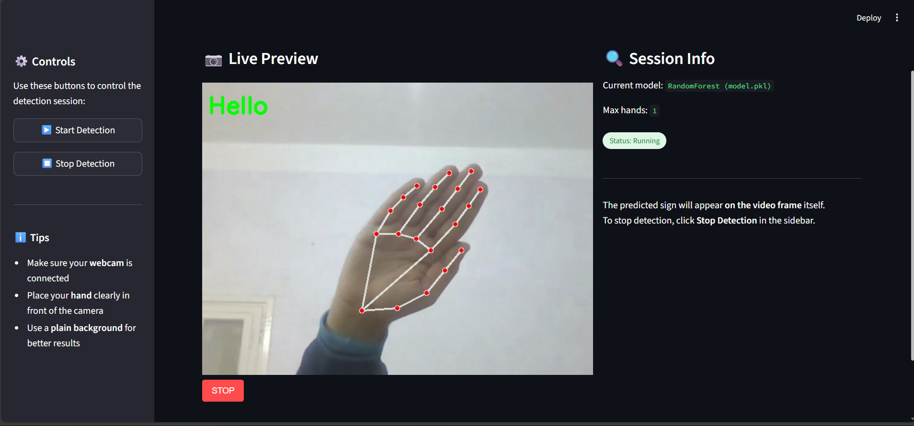

# 🖐️ Sign Language Detection – Real-Time Hand Gesture Recognition

## 📌 Overview  
This project implements a lightweight and accurate real-time sign-language word detection system using hand-gesture recognition.  
It combines **Mediapipe hand-landmark tracking** with a **Random Forest machine-learning model**, packaged inside a friendly, intuitive **Streamlit user interface**.


---

## 🚀 Features
- Real-time hand tracking  
- Detection of selected sign-language gestures  
- Mediapipe landmark extraction (21 points → 42 features)  
- Custom-built dataset for optimal model accuracy  
- Lightweight and fast execution  
- Simple UI for camera control and visualization  

---


## 👥 Team Members  
- Abdelrahman Elsebaiey  
- Ahmed Hassan  
- Mohamed Elnemr  
- Nora Mohamed  
- Ziyad Fouda  

---

## 📊 Dataset  
### ❗ Why existing datasets failed  
Public datasets were insufficient due to:  
- Poor image quality and inconsistency  
- Bad lighting and orientation  
- Not optimized for Mediapipe landmarks  
- Inconsistent labeling formats  
- YOLO bounding boxes detect hands, not hand gesture shapes  

### 🧪 Our custom dataset  
- Each gesture recorded manually using webcam  
- Mediapipe extracts **21 hand landmarks**  
- Each sample contains **42 numeric features (x, y)**  
- ~300 samples per gesture  
- Stored in CSV or NumPy format  

---

## ✋ Mediapipe Hand Tracking  
We use Google’s Mediapipe framework for:  
- Palm detection → bounding box  
- Hand landmark estimation → 21 3D joints  
- Normalized outputs (0–1)  
- Tracking mode for frame-to-frame stability  

Used for:  
- Gesture recognition  
- Sign-language classification  
- AR/VR interaction  
- Robotics  
- Human–computer interaction  

---

## 🤖 Machine Learning Model  
The classification model is **Random Forest**, selected for its:  
- Robustness with noisy data  
- Strong generalization  
- Stability in real-time predictions  
- Good performance on landmark-style numerical features  

---

## 🧩 User Interface (Streamlit)  
The UI includes:  
- Start / Stop camera button  
- Live video streaming  
- Real-time gesture classification  
- Clean and intuitive layout  


---

## 🛠️ Installation & Usage

### 1️⃣ Clone the repository:
```bash
git clone https://github.com/zFoudaz/Hand-Gesture-Recognition-System.git
cd Hand-Gesture-Recognition-System
```
```bash
pip install -r requirements.txt
```
run the local version (using cv2 for camera):
```bash
streamlit run app_local.py
```
## 📁 Project Structure
```bash
.
├─ script to collect data.py
├─ merge_into_data.py
├─ app_local.py
├─ app_online.py
├─ model.pkl
├─ data.csv
├─ imgs/
│   ├─ classes.png
│   ├─ preview.png
│   ├─ thumbnail.png
│   └─ hand-landmarks.png
└─ README.md
```
